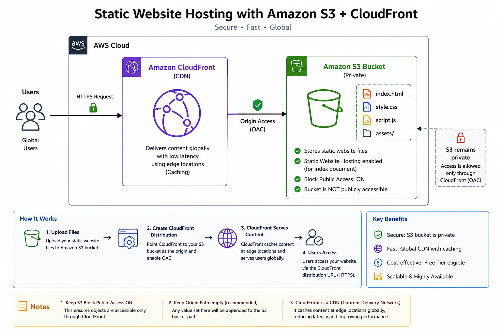

# 🚀 Deploy Static Website using Amazon S3 + CloudFront

This project demonstrates how to host a static website using **Amazon S3** for storage and **Amazon CloudFront** as a CDN for secure, fast, and globally distributed content delivery.

---

## 📌 Architecture Overview

- **Amazon S3** → Stores static website files (HTML, CSS, JS, images)
- **Amazon CloudFront** → Acts as a CDN to deliver content globally with low latency
- **Security Model** → S3 bucket remains private; CloudFront is the only public access point

---

## 🛠️ Deployment Steps

### 1. Create s3 bucket with default settings and upload files and folders.

### 2. Create CloudFront distribution -> Select free tier -> Next
	  - Distribution name: s3BucketCloudFrontDeploy, Distribution type: Single website or app -> Next
    - Origin Type: Amazon s3, S3 Origin: select the s3 bucket we have created above, leave remaining else as default (make sure under settings -> Allow private s3 bucket access to cloudfront) -> Next 
	  - Next
	  - Create Distribution

### 3. Now copy the distribution URL and attach index.html. It should display the webpage. Example: https://d3ge9542scvr2v.cloudfront.net/index.html

---

## 📝 Important Notes

- 🔒 **S3 Bucket Security**
  - Always keep **Block Public Access enabled**
  - CloudFront should be the only access layer to S3 content

- 📁 **Origin Path Best Practice**
  - Keep it empty unless specifically required
  - Any value added will be prefixed to S3 object paths and may break routing

- 🌍 **CloudFront as a CDN**
  - CloudFront is global service in AWS(no need to change region on top bar) because it is built as a worldwide distributed Content Delivery Network (CDN) with infrastructure spread across many geographic locations.
  - CloudFront improves performance using edge caching
  - It reduces latency by serving content from nearest edge location
  - It enhances security by hiding direct S3 access

---

## 🎯 Outcome

After completing this setup:
- Static website is hosted on S3
- Content is securely delivered via CloudFront
- S3 bucket is not publicly accessible
- Global performance is optimized using CDN
- If we have multiple images, we can test by adding images path to the URL and see that images are displayed within no-time due to it's caching.

---	